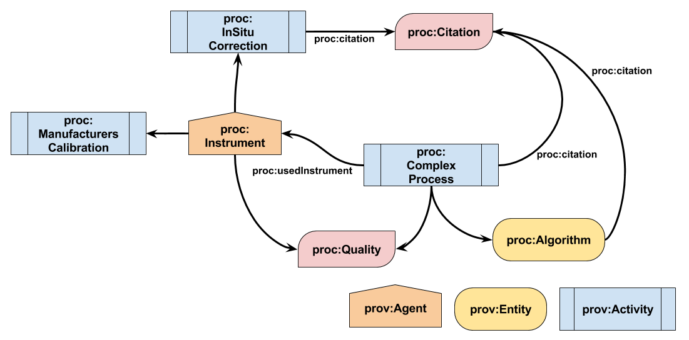
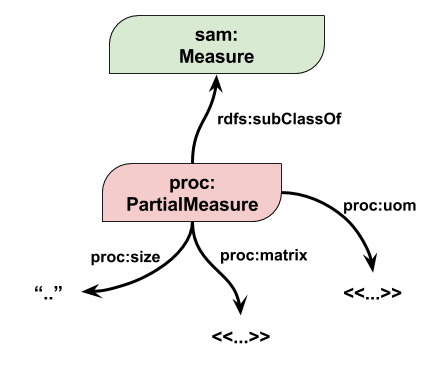
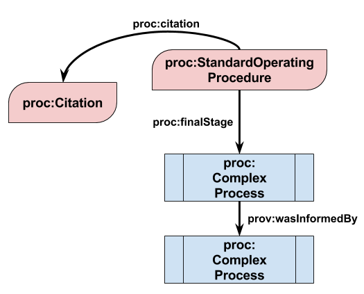

# complex-processes
An ontology and associated examples for describing processes for ISO/OGC Obersvation &amp; Measurements and Sampling
## Contents
- [Classes](#classes)
    + [Accuracy](#accuracy) | [Algorithm](#algorithm) | [Citation](#citation) | [ComplexProcess](#complexprocess) | [InSituCorrection](#insitucorrection) | [Instrument](#instrument) | [LimitsOfDetection](#limitsofdetection) | [ManufacturersCalibration](#manufacturerscalibration) | [Maximum](#maximum) | [Minimum](#minimum) | [OperatingRange](#operatingrange) | [PartialMeasure](#partialmeasure) | [Precision](#precision) | [Quality](#quality) | [RangedLimitsOfDetection](#rangedlimitsofdetection) | [Resolution](#resolution) | [StandardOperatingProcedure](#standardoperatingprocedure) | [UnrangedLimitsOfDetection](#unrangedlimitsofdetection)
- [Properties](#properties)
    + [citation](#citation-1) [finalStage](#finalstage) | [matrix](#matrix) | [partialMeasure](#partialmeasure-1) | [size](#size) | [uom](#uom) | [usedInstrument](#usedinstrument)
- [Namespaces Used](#namespaces-used)

An overview of the classes which make up the ontology and how they are connected is illustrated below.



---

## Classes
### Accuracy
Accuracy

**Sub-class of** [LimitsOfDetection](#limitsofdetection)

### Algorithm
The Algorithm class is used to describe data processing equations and calculations.

**In domain of** [citation](#citation-1) | [responsibleOrganisation](#responsibleorganisation)

**Sub-class of** prov:Entity

### Citation
The Citation class is used to describe the academic literature reference used to define a ComplexProcess, Algorithm, InSituCorrection or StandardOperatingProcedure.

### ComplexProcess
The ComplexProcess class

**In domain of** [citation](#citation-1) | [responsibleOrganisation](#responsibleorganisation) | [usedInstrument](#usedinstrument)

**In range of** [finalStage](#finalstage)

**Sub-class of** sam:Process | om:Process | prov:Activity

### InSituCorrection
The InSituCorrection class describes offsets applied to sensor measurements determined after comparison with discrete measurements made on Sampling Specimens.

**In domain of** [citation](#citation-1) | [responsibleOrganisation](#responsibleorganisation)

**Sub-class of** prov:Activity

### Instrument
The Instrument class describes characteristics of the sensor used to generate an Observation

**In range of** [usedInstrument](#usedinstrument)

**Sub-class of** prov:Agent

### LimitsOfDetection
This is a super-class for describing accuracy, resolution, precision etc...

LimitsOfDetection has two sub-classes: [RangedLimitsOfDetection](#rangedlimitsofdetection) where a minimum and maximum value are to be applied to the limits and UnrangedLimitsOfDetection where only one value is applied to the limit.

The hierarchy of the LimitsOfDetection class and its sub-classes are illustrated below.


### ManufacturersCalibration
The ManufacturersCalibration class describes instrument calibrations undertaken by their manufacturer.

**In domain of** [responsibleOrganisation](#responsibleorganisation)

**Sub-class of** prov:Activity

### Maximum
The Maximum class is a sub-class of UnrangedLimitsOfDetection but is used to put the maximum bound on a [RangedLimitsOfDetection](#rangedlimitsofdetection).

**Sub-class of** [UnrangedLimitsOfDetection](#unrangedlimitsofdetection)

### Minimum
The Minimum class is a sub-class of UnrangedLimitsOfDetection but is used to put the minimum bound on a [RangedLimitsOfDetection](#rangedlimitsofdetection).

**Sub-class of** [UnrangedLimitsOfDetection](#unrangedlimitsofdetection)

### OperatingRange
OperatingRange

**Sub-class of** [RangedLimitsOfDetection](#rangedlimitsofdetection)

### PartialMeasure
The PartialMeasure class is for use where a sam:Specimen samples more than one matrix (such as air and water in pCO2 measurements. The class is illustrated below:



**In domain of** [matrix](#matrix) | [size](#size)

**In range of** [partialMeasure](#partialmeasure-1)

### Precision
Precision

**Sub-class of** [UnrangedLimitsOfDetection](#unrangedlimitsofdetection)

### Quality
The Quality class retains information about the Process such as Limits of Detection; Uncertainity; Accuracy and Precision

### RangedLimitsOfDetection
The RangedLimitsOfDetection class is used to describe those limits of detection which have both a maximum and minimum value associated with them, such as [OperatingRange](#operatingrange). Taking OperatingRange as an example, the RangedLimitsOfDetection would be encoded thus:
```turtle
<_:anOperatingRange> a proc:OperatingRange;
	proc:maxiumum <_:aMaximum>;
	proc:minimum <_:aMinimum>.
	
<_:aMaximum> a proc:Maximum;
	proc:value 12;
	proc:uom <_:someUnitOfMeasure>.
	
<_:aMinimum> a proc:Minimum;
	proc:value 0;
	proc:uom <_:someUnitOfMeasure>.
```

**Sub-class of** [LimitsOfDetection](#limitsofdetection)

### Resolution
Resolution

**Sub-class of** [UnrangedLimitsOfDetection](#unrangedlimitsofdetection)

### StandardOperatingProcedure
The class StandardOperatingProcedure is used to contain a chain of ComplexProcesses which are commonly used together.

This is illustrated below:



A full chain can be created thus:
```turtle
<_:standardOperatingProcedure> a proc:StandardOperatingProcedure;
	proc:finalStage <_:lastStep>.
	
<_:lastStep> a proc:ComplexProcess;
	rdfs:seeAlso <_:registeredProcessDefinition>;
	prov:wasInformedBy <_:penultimateStep>.
```

**In domain of** [citation](#citation-1) | [finalStage](#finalstage)

### UnrangedLimitsOfDetection
The UnrangedLimitsOfDetection class is used to describe those limits of detection which have only one value associated with them, such as [Accuracy](#accuracy).

**Sub-class of** [LimitsOfDetection](#limitsofdetection)

---

## Properties
### citation
The citation property is used to connect a ComplexProcess, Algorithm or StandardOperatingProcedure to a literature reference describing the process.

**Domain** [Algorithm](#algorithm) | [ComplexProcess](#complexprocess) | [InSituCorrection](#insitucorrection) | [StandardOperatingProcedure](#standardoperatingprocedure)

**Range** [Citation](#citation)

### finalStage
The property finalStage is used to connect a StandardOperatingProcedure to the last ComplexProcess used in the chain which makes up the StandardOperatingProcedure. 

**Domain** [StandardOperatingProcedure](#standardoperatingprocedure)

**Range** [ComplexProcess](#complexprocess)

### matrix
The property matrix links a PartialMeasure to a URL defining the environmental sphere of this PartialMeasure, e.g. atmosphere

**Domain** [PartialMeasure](#partialmeasure)

### partialMeasure

**Domain** sam:Measure

**Range** [PartialMeasure](#partialmeasure)

### responsibleOrganisation
The responsibleOrganisation property connects an Algorithm, a ComplexProcess, an InSituCorrection, or a ManufacturersCalibration to the organisation responsible for that process, or part-process

**Domain** [Algorithm](#algorithm) | [InSituCorrection](#insitucorrection) | [ComplexProcess](#complexprocess) | [ManufacturersCalibration](#manufacturerscalibration)

**Range** rdfs:Resource

### size
The property size is define how much substance a PartialMeasure represents

**Domain** [PartialMeasure](#partialmeasure)

**Range** rdfs:Literal

### usedInstrument
Assigns an instrument to an Observation Process

**Domain** [ComplexProcess](#complexprocess)

**Range** [Instrument](#instrument)

**Sub-property of** [prov:wasAssociatedWith](http://www.w3.org/ns/prov#wasAssociatedWith)

### uom
The property uom links an instance to a resource defining its units of measure

**Domain** [PartialMeasure](#partialmeasure) | [Uncertainty](#uncertainty) | [UnrangedLimitsOfDetection](#unrangedlimitsofdetection)

---

## Namespaces Used
cpm: http://purl.org/voc/cpm#
prov: http://www.w3.org/ns/prov#
skos: http://www.w3.org/2004/02/skos/core#
